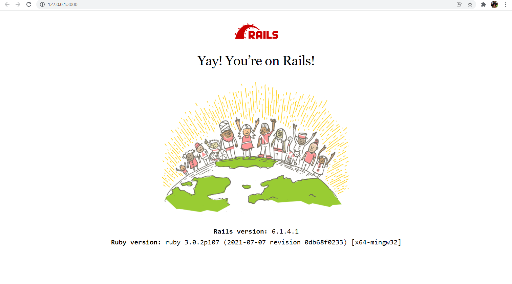

# Hello Rails app

> Use RubyGems as a software package system.

RubyGems is the package manager that handles all the gems on your machine. From the command line you can search for gems, install and uninstall gems, list current gems, and perform other such commands. As a repository of gems, it's not only a great resource for finding gems to work with, you can also publish your own gems there!

## Built With

- Ruby
- SQLite3
- Node.js
- Yarn
- Rails

## Authors

👤 **Herbert**

- GitHub: [Herbert](https://github.com/herokudev)
- LinkedIn: [Herbert](https://www.linkedin.com/in/herbert-orellana)
- Twitter: [v](https://twitter.com/HerbertOrellan4)

## Show your support

Give a ⭐️ if you like this project!

## 📝 License

This project is [MIT](./MIT.md) licensed.
